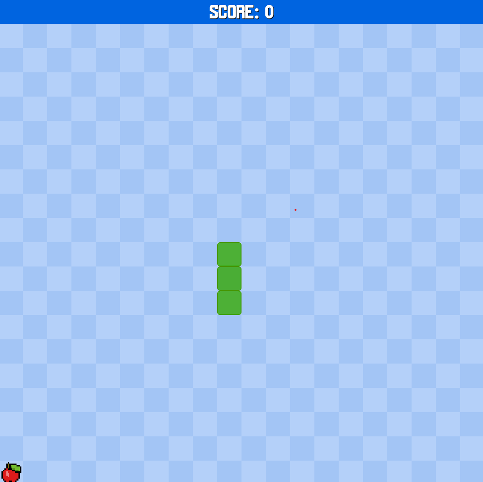

# 🐍 Snake Game — Projeto em Godot Engine

## 📝 Descrição do Projeto

Este é um **jogo clássico da cobrinha (Snake Game)** desenvolvido inteiramente por mim usando a **Godot Engine**, com o objetivo de:

- Aprender os fundamentos da engine  
- Entender a lógica básica de movimentação, colisão e pontuação  
- Explorar o fluxo de criação de jogos 2D simples

O projeto foi concluído com sucesso e serve como uma **base de estudo e aprendizado pessoal**.

---

## 🎯 Objetivo do Projeto

- 📚 Praticar a lógica de programação aplicada em jogos 2D  
- 🧪 Testar as ferramentas e recursos oferecidos pela Godot Engine  
- 🎮 Criar um jogo jogável, funcional e finalizado como **prova de conceito**

Este projeto é **100% educativo** e não possui fins comerciais.

---

## 📹 Tutorial Utilizado

Grande parte do aprendizado veio do excelente tutorial do canal **Game Development Center** no YouTube:

🔗 [Tutorial - Snake Game in Godot (YouTube)](https://youtu.be/DlRP-UBR-2A?si=bkXAIcsXvAQryo7l)

> O código foi feito por mim do zero, mas baseado nas explicações do vídeo.

---

## 📸 Imagem do Jogo

  

---

## 👨‍💻 Desenvolvedor

- 👤 Projeto criado individualmente  
- 🔧 Ferramenta usada: **Godot Engine (vX.X.X)**  
- 💡 Apenas como hobby e estudo pessoal de mecânicas

---

## ✅ Status do Projeto

🟢 **Concluído** — Jogo funcional e estável.

---

## 📂 Organização do Repositório

